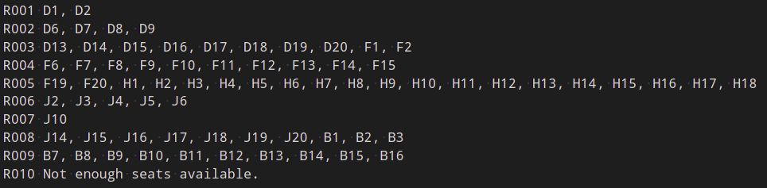

# theater-seating
A python program that determines a seating chart in a movie theater. 

# Input

The input for this program is a text reservation file, of the form:

The left-hand column is the reservation name/id, and the right-hand column is the number of seats requested for that reservation.

# Output

The output for this program is a text seating placement file, of the form:

The left-hand column is the reservation name/id, and the right-hand column lists the seats reserved. 

# Assumptions

The program places at least 3 seats between groups in a row, and fills in every other row in the theater. 

- It assumes most people would like to sit in the 4th row, and would prefer to sit as close as possible to the 4th row (but behind) as a second choice. After filling up all rows behind the 4th row, it fills in rows in the front starting with the rows furthest back.

- The program assigns seats on a first-come first-served basis.

# Options

- The number of rows can be increased up to 26 (the number of letters in the alphabet) by using the keyword argument `SeatTheater(<reservation_file>, rows=20)` (this would give the theater 20 rows). 
- The number of columns can be increased by using the keyword argument `SeatTheater(<reservation_file>, cols=21)` (this would give the theater 21 seats per row). 
- The initial row (i.e. the row we assume everyone would most like to sit in) can be changed by passing the keyword argument `SeatTheater(<reservation_file>, initial_row=5)` (this would prioritize the 5th row, then fill in behind the fifth row). 
- The keyword argument `row_buffer` will change the number of rows there are between guests.
- The keyword argument `col_buffer` will change the number of seats there are between guests in a row. 

# Graphical Representation

The `SeatTheater` class includes a method to print out a representation of the theater seat placement:

# Limitations

- At the moment, there is no way to print the theater seating arrangement to a file. This would not be difficult to implement. 
- The seating arrangement makes only some attempt to place all reservations of a group in the same row. This could be arranged, but would change the seating algorithm considerably.
- If there is one group occupying the seats at the end of a row, then the next group (in the next row) will also get shifted over 3 seats (even though they are a row away from the first group). You can see this phenomenon happening in row J in the seating arrangement below:

 This would not be too difficult to fix. 
- At the moment, `print_placement()` is not very efficient. It first loops through all the reservations and all seats reserved in each reservation, then loops through all rows and columns of the theater. Refactoring `guest_placement()` to provide more data could be a fix. So far I've decided to keep `guest_placement()` as efficient as possible, while leaving `print_placement()` not as efficient. 
- If there are not enough seats to place an entire group, no one in the group is placed, and the reservation shows up as "Not enough seats available." It may be better to place all the possible reservations, even if the entire group doesn't fit. 

# How to Run

- Python must be installed on your computer. See [Python.org](https://www.python.org/downloads/) or look for instructions specific to your operating system. You can check if you have Python installed by typing `python` into a terminal (it may be installed even if this doesn't work, for example in Ubuntu you might want to type `python3`).
- Clone this repository to your computer. See [GitHub.com](https://docs.github.com/en/github/creating-cloning-and-archiving-repositories/cloning-a-repository) for more details.
- In a terminal window, change the directory to the theater-seating repository folder. 
- Type `python SeatTheater.py reservations.txt` to run the program with the example file included in the repository. 
- Either edit `reservations.txt` as you wish, or create your own file and type `python SeatTheater.py path/to/your/reservations.txt` then hit enter. The output file will be named `seating_placement.txt` and will be created in the same directory as your reservations file. 